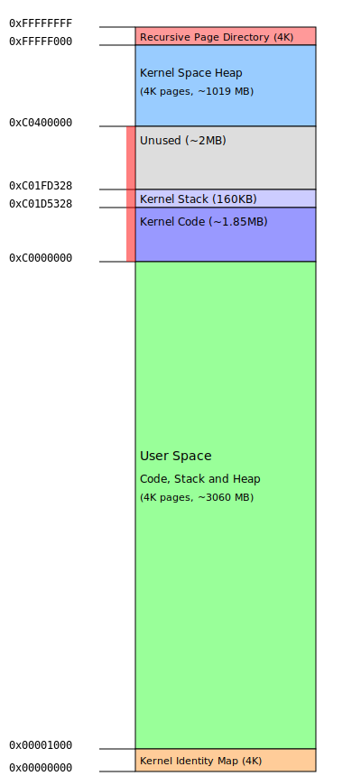

# x86 Paging Memory Management

## Overview
The paging system implements a 4-GiB virtual memory map through a two-level table structure:
* Page Directory → Page Tables → Physical Memory Pages
* Each level contains 1024 entries of 4 bytes each
* Each page table entry points to a 4 KiB physical page frame

## Virtual Address Structure
```
31           22 21           12 11            0
+-------------+-------------+----------------+
| Directory   | Table       | Offset         |
| (10 bits)   | (10 bits)   | (12 bits)      |
+-------------+-------------+----------------+
```

### Memory Components

#### Page Directory
* Must be 4 KiB aligned
* Contains 1024 entries (4 bytes each)
* Controls access to page tables
* Page directory entry flags:
  * PAT: Page Attribute Table (set to 0 if unsupported)
  * G (Global): Controls TLB entry invalidation on CR3 updates (requires CR4.PGE)
  * PS (Page Size): 0 = 4 KiB pages, 1 = 4 MiB pages (requires PSE)
  * D (Dirty): Indicates page was written to
  * A (Accessed): Set during address translation
  * PCD (Cache Disable): 1 = Disable caching for this page
  * PWT (Write-Through): Controls cache write-through behavior
  * U/S (User/Supervisor): Controls privilege-level access
  * R/W (Read/Write): Controls write permissions
  * P (Present): Indicates if page is in physical memory

#### Page Table
* Must be 4 KiB aligned
* Contains 1024 entries (4 bytes each)
* Each entry maps to a 4 KiB physical page

### Special Considerations
* Bits 9-11 are available for OS use
* If PS=0, bits 6 & 8 are also available
* User pages require U bit set in both directory and table entries
* Write protection behavior is influenced by CR0.WP
* Translation failures trigger CPU page faults

### Protection and Privileges
* The U/S (User/Supervisor) bit controls access based on privilege level
* R/W permissions can be configured differently for kernel and userland
* CR0.WP determines if kernel bypasses write protection
* Page faults occur on invalid translations or permission violations

### Memory Layout Notes
* Page directory points to page tables (1024 * 4 byte entries)
* Page tables point to physical pages (1024 * 4 byte entries)
* Each page table entry points to a 4 KiB physical page frame
* Virtual address bits:
  * 22-31: Index of page directory
  * 12-21: Index of page table entry
  * 0-11: Page offset

* Enable paging
* Map kernel to upper half of memory.

### Memory Layout


