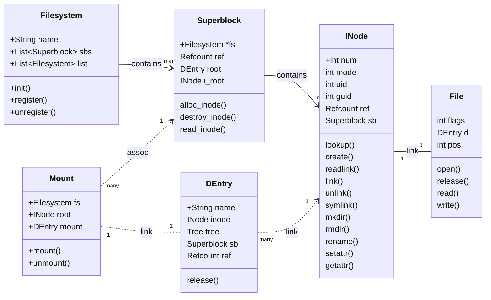
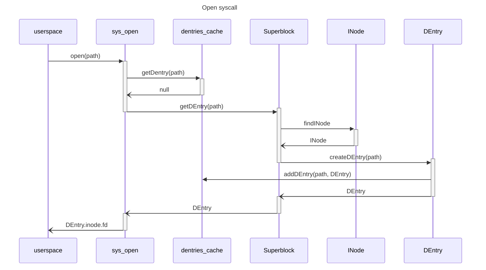

# File system

# Related syscalls

- For file:
    - open, openat -> fd
    - close (fd)
    - read, write, lseek (fd)
    - fstat (fd)
    - dup (fd)
    - dup2, dup3 (fd, fd)
    - ftstatfs (fd)
    - statx (fd)
    - cachestat (fd)
    - mmap (fd)
    - ioctl (fd)
    - fcntl (fd)
    - flock (fd)
    - fsync (fd)
    - fdatasync (fd)
    - truncate (path)
    - ftruncate (fd)
    - getdents (fd)
    - fchdir (fd)
    - creat (path) -> fd
    - fchmod, fchmodat (fd)
    - fchown, fchownat (fd)
    - futimens, utimensat (fd)
    - poll (fd)
    - select (fd)
    - inotify_init, inotify_add_watch, inotify_rm_watch
    - splice (fd, fd)
    - tee (fd, fd)
    - sync_file_range (fd)
    - copy_file_range (fd, fd)
- For dentry:
    - stat, ftsatat, lstat (path)
    - access (path)
    - getcwd -> path
    - chdir (path)
    - rename, renameat (path, path)
    - mkdir, mkdirat (path)
    - rmdir (path)
    - link, linkat (path, path)
    - unlink, unlinkat (path)
    - symlink, symlinkat (path, path)
    - readlink. readlinkat (path)
    - chmod (path)
    - chown, lchown (path)
    - setxattr, lsetxattr, fsetxattr, setxattrat
    - getxattr, lgetxattr, fgetxattr, getxattrat
    - listxattr, llistxattr, flistxattr, listxattrat
    - removexattr, lremovexattr, fremovexatt, removexattrat
- For mount
    - statmount (mnt_id)
    - chroot (path)
    - mount (dev, path)
    - umount (path)
- For superblock
    - statfs (path)
    - mknod, mknodat (path) -> fd
- For filesystem:
    - ustat (dev)
    - sysfs (fs name)
    - syncfs (fd)

# Referencing

Dentry: children reference parent
In-memory fs's: dentries start with refcount 2
Dentries reference inodes
File reference dentry
Path walk: reference curr and AFTER unreference prev
